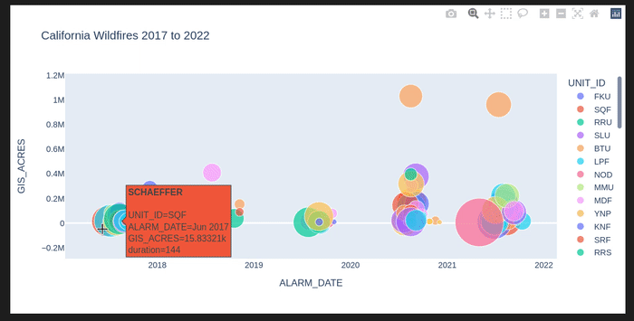
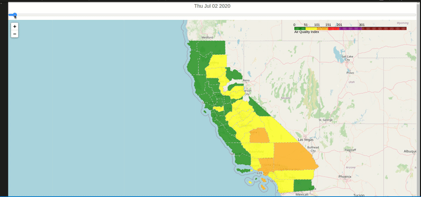

# Wild Fires and their wide ranging effects on the health of the population
Every year California wildfires season is becoming longer with the state witnessing more mega-fires (a term that refers to fires that burn more than 100,000 acres) in the recent years. This means that almost all the 58 counties in California are living in conditions where air quality is unhealthy to very unhealthy to downright hazardous!

This article from [epa.gov](https://www.epa.gov/air-research/wildland-fire-research-health-effects-research) says that:

    Larger and more intense wildfires are creating the potential for greater smoke production and chronic exposures in the U.S., particularly in the West. Wildfires increase air pollution in surrounding areas and can affect regional air quality.

    The effects of smoke from wildfires can range from eye and respiratory tract irritation to more serious disorders, including reduced lung function, bronchitis, exacerbation of asthma and heart failure, and premature death. Children, pregnant women, and the elderly are especially vulnerable to smoke exposure. Emissions from wildfires are known to cause increased visits to hospitals and clinics by those exposed to smoke.)

This project is an effort to plot the size of the fires in the last 5 years and to get a sense of how the air quality is affected by the fires.

Most of the information as to where I downloaded the datasets from and how you can procure them is in the notebook.

There are two important outputs of this project:

    1. The 5 year California scatter plot 
    2. The TimeSliderChoropleth of the year 2020 to demonstrate the AQI reaching unhealthy levels during the wildfires.

## How to use:
1. Create a new conda environment using enivornment.yml
*     conda env create --file environment.yml
*     This will create AqiEnv conda environment
2. Invoke the environment:
*     either with conda activate AqiEnv
*     or select the AqiEnv kernel in Visual Studio