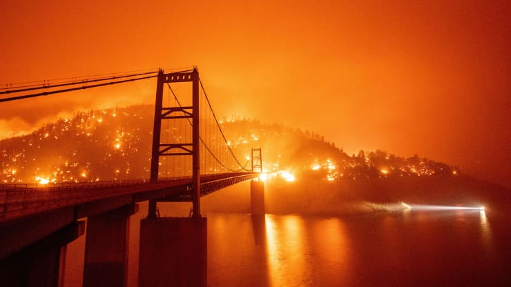

# Wild Fires and their wide ranging effects on the health of the population
Every year California wildfires season is becoming longer with the state witnessing more mega-fires (a term that refers to fires that burn more than 100,000 acres) in the recent years.

This project is an effort to plot the size of the fires in the last 5 years and to get a sense of how the air quality is affected by the fires.

Most of the information as to where I downloaded the dataset from and how you can procure it is in the notebook.

There are two important outputs of this project:

    1. The 5 year California scatter plot 
    2. The TimeSliderChoropleth of the year 2020 to demonstrate the AQI reaching unhealthy levels during the wildfires.

## How to use:
1. Create a new conda environment using enivornment.yml
*     conda env create --file environment.yml
*     This will create AqiEnv conda environment
2. Invoke the environment:
*     either with conda activate AqiEnv
*     or select the AqiEnv kernel in Visual Studio